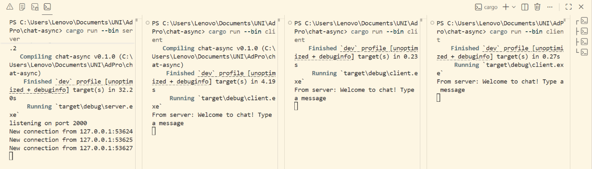
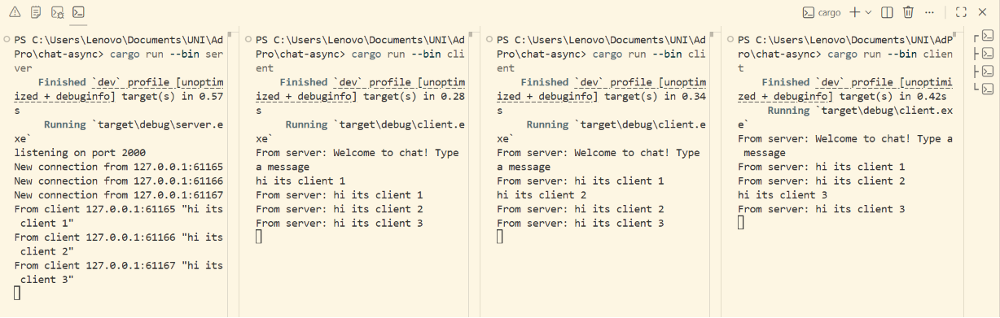

## Experiment 2.1: Original code, and how it run

### How to run
1. Buka 4 terminal
2. Jalankan server di salah satu terminal: `cargo run --bin server`
3. Jalankan 3 client di terminal lainnya: `cargo run --bin client`

### Output
1. Client dapat welcome message

2. Client mengirim pesan

### Explanation
Server listening connection di port 2000. Setiap client yang connect akan mendapatkan welcome message dari server. Ketika salah satu client mengetikkan pesan, server menerima pesan tersebut lalu membroadcast ke semua client yang sedang terhubung melalui tokio broadcast channel.

Ini bekerja secara asynchronous. Tiap koneksi client ditangani oleh satu async task (bukan thread baru), sehingga lebih hemat resource. Di dalam setiap task, `tokio::select!` menunggu dua hal sekaligus: pesan baru dari client (lalu di-broadcast ke semua), dan pesan broadcast dari server (lalu dikirim balik ke client ini). Tanpa `tokio::select!`, kita harus memilih salah satu, tidak bisa keduanya sekaligus.