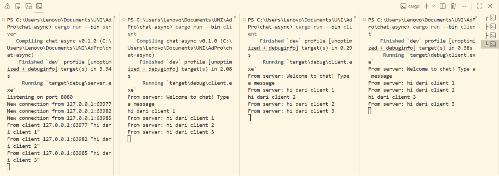
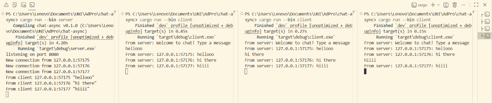

## Experiment 2.1: Original code, and how it run

### How to run
1. Buka 4 terminal
2. Jalankan server di salah satu terminal: `cargo run --bin server`
3. Jalankan 3 client di terminal lainnya: `cargo run --bin client`

### Output
1. Client dapat welcome message

2. Client mengirim pesan

### Explanation
Server listening connection di port 2000. Setiap client yang connect akan mendapatkan welcome message dari server. Ketika salah satu client mengetikkan pesan, server menerima pesan tersebut lalu membroadcast ke semua client yang sedang terhubung melalui tokio broadcast channel.

Ini bekerja secara asynchronous. Tiap koneksi client ditangani oleh satu async task (bukan thread baru), sehingga lebih hemat resource. Di dalam setiap task, `tokio::select!` menunggu dua hal sekaligus: pesan baru dari client (lalu di-broadcast ke semua), dan pesan broadcast dari server (lalu dikirim balik ke client ini). Tanpa `tokio::select!`, kita harus memilih salah satu, tidak bisa keduanya sekaligus.

## Experiment 2.2: Modifying port

### Output

### Explanation
Karena WebSocket adalah protokol komunikasi dua arah, kedua sisi (client & server) harus menggunakan port yang sama agar bisa terhubung. Jadi, perubahan dilakukan pada file:

- `src/bin/server.rs`: `TcpListener::bind("127.0.0.1:2000")` jadi `TcpListener::bind("127.0.0.1:8080")`
- `src/bin/client.rs`: URI `ws://127.0.0.1:2000` jadi `ws://127.0.0.1:8080`

Both are using the same protocol `ws://`, karena WebSocket mendukung komunikasi dua arah yang persistent, cocok untuk aplikasi chat. Di `client.rs`, protokol didefinisikan di URI `ws://127.0.0.1:8080`. Di `server.rs`, protokol didefinisikan secara implisit melalui `ServerBuilder::new().accept(socket)`.

## Experiment 2.3: Small changes, add IP and Port

### Output

### Explanation
Perubahan dilakukan di `src/bin/server.rs` pada fungsi `handle_connection`. 
- **Before**: `bcast_tx.send(text.into())?`. Pesan yang dibroadcast hanya berisi teks mentah dari client.
- **After**: `bcast_tx.send(format!("{addr}: {text}"))?`

Variabel `addr` yang sudah ada sebagai parameter fungsi `handle_connection` berisi IP dan port dari client yang mengirim pesan. Kemudian addr dan text digabungkan menggunakan `format!`. Hasilnya, setiap client yang menerima pesan sekarang bisa tahu siapa pengirimnya (based on IP & port), misal: `127.0.0.1:54321: hello`.

## (Tutorial 3) Bonus: Rust Websocket server for YewChat!

Server JavaScript (SimpleWebsocketServer) diganti dengan server Rust dari Tutorial 2. YewChat tidak perlu diubah sama sekali karena format JSON yang digunakan tetap sama.

Yang diubah hanya `src/bin/server.rs` dari code Tutorial 2:

**1. Parse JSON**:
Server yang awalnya hanya menangani plain text dibuat jadi parse JSON dari YewChat yang memiliki 2 tipe pesan: `register` (saat user login) dan `message` (saat user kirim pesan).

**2. Shared State dengan `Arc<Mutex<Vec<String>>>`**:
Daftar user aktif disimpan dalam `Arc<Mutex<Vec<String>>>` untuk mendukung async task. Setiap connection client berjalan di task terpisah, sehingga perlu sesuatu untuk sharing data yang thread-safe.

**3. Broadcast Format**:
Setiap event dibroadcast ke client dengan awalan/prefix:
- `__MSG__:` untuk pesan chat. Format JSON `{messageType: "message", data: ...}`
- `__USERS__:` untuk update list user. Format JSON `{messageType: "users", dataArray: [...]}`

**4. Auto-update User List**:
Setiap kali ada user register atau disconnect, server langsung broadcast list user terbaru ke semua client yang terhubung. Sehingga "Users" di sidebar YewChat bisa selalu update secara realtime.   

**Preferensi**:
Secara penulisannya, saya lebih suka JavaScript version karena kodenya jauh lebih singkat dan mudah untuk dibaca. Jika ada bug juga bisa lebih cepat didebug. Tapi secara production/reliability, tentu Rust version lebih bagus karena kesalahan-kesalahan seperti lupa handle edge case atau akses data yang tidak aman langsung ketahuan saat compile, bukan saat runtime. Jadi lebih tenang kalau sudah jalan, tidak tiba-tiba crash di tengah jalan.